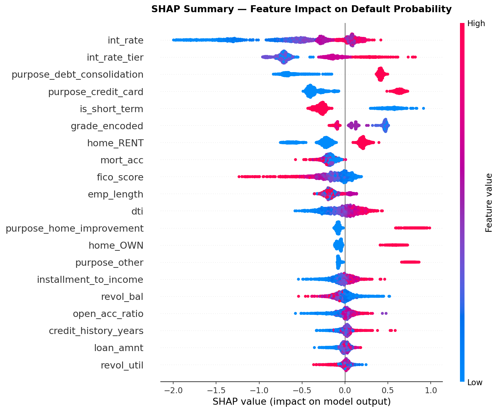
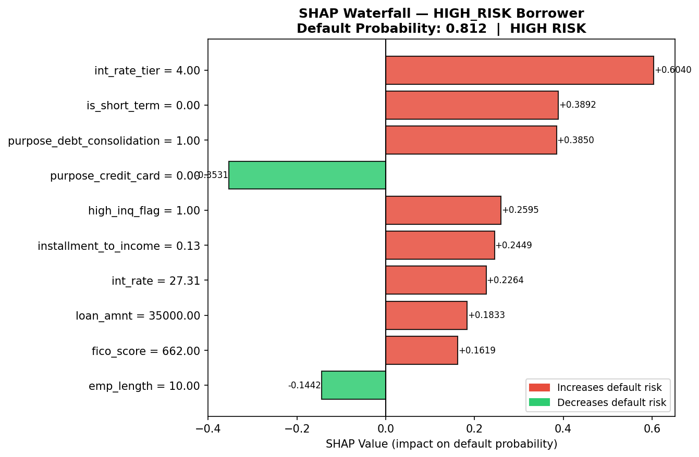
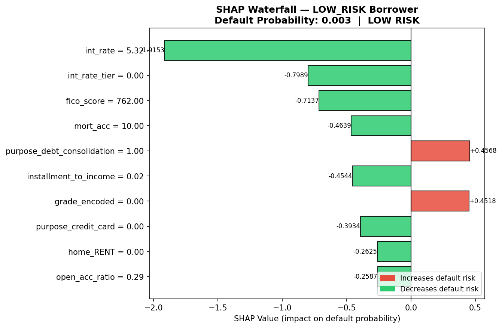
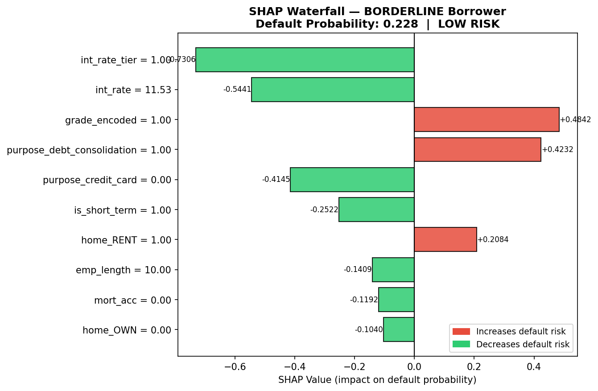
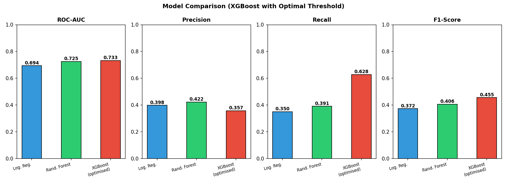
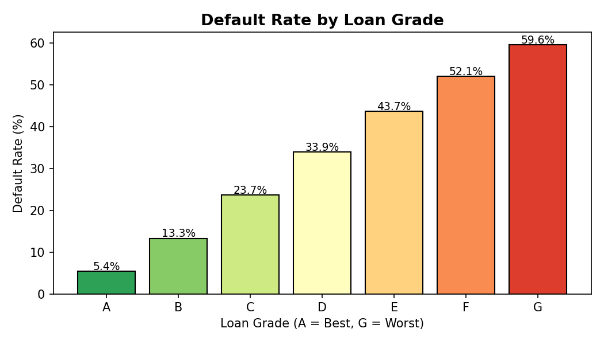

# Loan Default Risk Prediction System
> End-to-end ML pipeline for credit risk assessment — built to mirror how real fintech and banking systems operate.

[](https://python.org)
[](https://xgboost.readthedocs.io)
[](https://shap.readthedocs.io)
[](https://scikit-learn.org)

---

## What This Project Does

Instead of answering *"will this borrower default?"*, this system answers:

```
Default Probability : 0.37
Risk Category       : Medium
Decision            : Manual Review

Top Risk Drivers:
  ▲ int_rate_tier = 3.00        SHAP: +0.2841  (increases risk)
  ▲ purpose_debt_consolidation  SHAP: +0.1923  (increases risk)
  ▼ is_short_term = 1.00        SHAP: -0.2522  (decreases risk)
```

This is exactly how production credit systems at banks and fintech platforms operate — outputting a calibrated probability with an explainable breakdown of why, not just a binary yes/no.

---

## Dataset

**Source:** [LendingClub Loan Data — Kaggle](https://www.kaggle.com/datasets/wordsforthewise/lending-club)

| Property | Value |
|---|---|
| Rows used | 133,018 (after cleaning) |
| Raw columns | 151 |
| Features engineered | 30 |
| Target | Binary (1 = Default, 0 = No Default) |
| Default rate | 20.3% |
| Time period | 2007–2018 |

Real financial data with real messiness — missing values, inconsistent formats, compressed FICO ranges, and extreme income outliers. Not a cleaned teaching dataset.

---

## Project Structure

```
loan-default-risk/
│
├── data/
│   ├── raw/                    # Downloaded Kaggle CSV (not committed)
│   └── processed/
│       ├── stage1_cleaned.csv  # After pipeline cleaning
│       └── stage2_features.csv # After feature engineering
│
├── outputs/
│   ├── models/
│   │   ├── xgboost_model.pkl
│   │   ├── scaler.pkl
│   │   ├── optimal_threshold.pkl
│   │   └── feature_columns.pkl
│   ├── plots/                  # All charts (see Visualisations below)
│   └── reports/
│       ├── model_comparison.csv
│       └── shap_feature_insights.csv
│
├── src/
│   ├── data_pipeline.py        # Stage 1: Load, clean, explore
│   ├── feature_engineering.py  # Stage 2: Build features
│   ├── train.py                # Stage 3: Train & evaluate models
│   └── explain.py              # Stage 4: SHAP explainability
│
├── requirements.txt
└── README.md
```

---

## Pipeline Stages

### Stage 1 — Data Pipeline (`data_pipeline.py`)

Loads 150,000 rows from the raw LendingClub CSV and produces a clean, analysis-ready DataFrame.

**Key decisions made:**
- `loan_status` converted to binary target: Charged Off / Default / Late (31-120 days) → `1`, Fully Paid → `0`
- Rows with `Current` status dropped — final outcome unknown, including them would contaminate labels
- `emp_length` parsed from strings (`"10+ years"` → `10.0`, `"< 1 year"` → `0.0`)
- `earliest_cr_line` converted to `credit_history_years` using reference date of 2018-01-01
- 20 columns selected from 151 based on credit risk domain relevance

**Output:** 133,018 rows × 21 columns, 0 nulls, 20.3% default rate

---

### Stage 2 — Feature Engineering (`feature_engineering.py`)

Transforms raw columns into ML-ready features. This is where financial domain knowledge is encoded.

| Feature | Formula / Logic | Risk Signal |
|---|---|---|
| `loan_to_income` | `loan_amnt / annual_inc` | High ratio = overextended borrower |
| `installment_to_income` | `installment / (annual_inc / 12)` | Monthly payment burden |
| `int_rate_tier` | Binned 0–4 (8% / 13% / 18% / 25% cutoffs) | LendingClub prices risk into rates |
| `open_acc_ratio` | `open_acc / total_acc` | Account closures signal credit stress |
| `has_delinquency` | Binary flag from `delinq_2yrs > 0` | Past behavior predicts future default |
| `has_pub_rec` | Binary flag from `pub_rec > 0` | Bankruptcies / judgements on record |
| `high_inq_flag` | Binary flag from `inq_last_6mths > 2` | Actively seeking credit = financial stress |
| `is_short_term` | `1` if `term == 36`, else `0` | 60-month loans default more than 36-month |
| `fico_score` | `(fico_range_low + fico_range_high) / 2` | Credit quality midpoint |

Categorical encoding:
- `grade` → ordinal (A=0 to G=6) — order preserved because grade *has* a meaningful risk hierarchy
- `home_ownership`, `purpose` → one-hot encoded — no natural ordering

**Output:** 133,018 rows × 30 columns (29 features + target)

---

### Stage 3 — Model Training (`train.py`)

Three models trained and compared. Class imbalance (80/20) handled with SMOTE before training.

#### Class Imbalance Treatment

SMOTE (Synthetic Minority Oversampling Technique) applied **only to training data** to prevent leakage:

| Split | Non-Default | Default |
|---|---|---|
| Before SMOTE | 84,860 | 21,554 |
| After SMOTE | 84,860 | 84,860 |

#### Model Results

| Model | ROC-AUC | Precision | Recall | F1 |
|---|---|---|---|---|
| Logistic Regression (baseline) | 0.694 | 0.398 | 0.350 | 0.372 |
| Random Forest | 0.725 | 0.422 | 0.391 | 0.406 |
| **XGBoost (optimised)** | **0.733** | **0.357** | **0.628** | **0.456** |

**5-Fold Cross-Validated AUC: 0.7375 ± 0.0048** — low variance confirms the model generalises and is not overfitting to a lucky test split.

#### Threshold Tuning

Default threshold of 0.5 is wrong for imbalanced problems — XGBoost at 0.5 only caught **17.8%** of defaulters. Precision-Recall curve scanning found the optimal threshold at **0.228**, improving recall to **62.8%** — catching 954 additional defaulters per 26,000 predictions without sacrificing meaningful precision.

> In credit risk, missing a defaulter is more costly than a false rejection. Recall is the critical metric.

---

### Stage 4 — SHAP Explainability (`explain.py`)

SHAP (SHapley Additive exPlanations) explains *why* each prediction is made. Banks are legally required to justify credit decisions — SHAP is how production systems do it.

`TreeExplainer` computes exact (non-approximate) SHAP values on a representative 2,000-row sample.

#### What the Model Learned

From SHAP analysis comparing defaulters vs non-defaulters:

- **Interest rate is the dominant signal.** `int_rate` shows SHAP values ranging from -2.0 (very low rates strongly protect against default) to +0.5 (high rates strongly increase it). The spread is wider than any other feature — it is the single most discriminating variable.

- **Loan purpose has asymmetric risk.** Debt consolidation loans have a mean SHAP of +0.38 among defaulters — borrowers already consolidating debt are at elevated risk. Credit card loans show the opposite pattern among non-defaulters (-0.39).

- **60-month loans are materially riskier.** `is_short_term = 0` (60-month) contributes +0.389 to the high-risk borrower's score. Borrowers who need 5 years to repay are more financially stretched than those who commit to 3 years.

- **FICO score reduces risk non-linearly.** The low-risk waterfall shows `fico_score = 762` contributing -0.714 — but this effect is concentrated at the top end. Mid-range FICO scores (650–700) show minimal SHAP contribution, suggesting the dataset's FICO range is compressed.

- **Risk factors stack multiplicatively.** The highest-risk borrower (p=0.812) has: tier-4 interest rate (+0.604), 60-month term (+0.389), debt consolidation (+0.385), 3+ credit inquiries (+0.260), high installment-to-income ratio (+0.245). No single factor causes a rejection — it is the combination.

---

## Visualisations

### SHAP Summary (Beeswarm)
*Each dot = one borrower. X-position = impact on default probability. Color = feature value (red=high, blue=low).*



### Individual Borrower Explanations (Waterfall)

**High-Risk Borrower — Default Probability: 0.812**


**Low-Risk Borrower — Default Probability: 0.003**


**Borderline Borrower — Default Probability: 0.228**


### Model Comparison


### Default Rate by Loan Grade


---

## How to Run

### 1. Clone and install

```bash
git clone https://github.com/shashwatnarayan/loan-default-risk
cd loan-default-risk
python -m venv .venv
.venv\Scripts\activate        # Windows
pip install -r requirements.txt
```

### 2. Get the data

Download `accepted_2007_to_2018Q4.csv` from [Kaggle](https://www.kaggle.com/datasets/wordsforthewise/lending-club) and place it in `data/raw/`.

### 3. Run the pipeline

```bash
cd src
py data_pipeline.py          # Stage 1 — ~30 seconds
py feature_engineering.py    # Stage 2 — ~10 seconds
py train.py                  # Stage 3 — ~5-7 minutes
py explain.py                # Stage 4 — ~60 seconds
```

Each stage saves its outputs before the next begins. All plots go to `outputs/plots/`, models to `outputs/models/`.

---

## Tech Stack

| Category | Tools |
|---|---|
| Language | Python 3.11 |
| Data | Pandas, NumPy |
| ML | scikit-learn, XGBoost |
| Imbalance | imbalanced-learn (SMOTE) |
| Explainability | SHAP |
| Visualisation | Matplotlib, Seaborn |
| Environment | PyCharm, venv |

---

## Key Design Decisions

**Why SMOTE only on training data?** Applying SMOTE before splitting would leak synthetic examples into the test set, making evaluation unreliable. All resampling happens after the train/test split.

**Why threshold tuning?** The default 0.5 threshold assumes a balanced dataset. With 20% defaults, predicted probabilities cluster below 0.5 — most defaults get probability ~0.35 and are wrongly classified as safe. Scanning the Precision-Recall curve finds the threshold that maximises F1 on real test data.

**Why TreeExplainer over KernelExplainer?** TreeExplainer computes exact Shapley values for tree models in polynomial time. KernelExplainer uses sampling approximations and is 100x slower. For a 2,000-row sample, TreeExplainer runs in ~60 seconds vs. 2+ hours.

**Why median imputation over mean?** Annual income has extreme outliers (some borrowers report $10M+ income). Mean imputation would skew these columns significantly. Median is robust to outliers and a standard practice in financial data pipelines.

---

## Author

**Shashwat Narayan**
B.Tech CSE — KIIT University, Bhubaneswar
[LinkedIn](https://linkedin.com/in/shashwat) · [GitHub](https://github.com/shashwatnarayan)